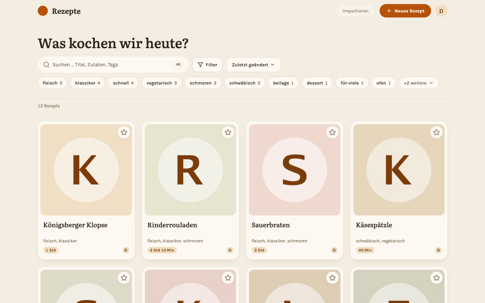

<div align="center">

# Rezepte

**The recipe manager I wanted for my own kitchen.** Self-hosted, one binary, no cloud account.

[](https://github.com/s-frei/rezepte/actions/workflows/ci.yml)
[](https://s-frei.github.io/rezepte/)
[](LICENSE)

[Documentation](https://s-frei.github.io/rezepte/) · [Getting started](https://s-frei.github.io/rezepte/getting-started/) · [Features](https://s-frei.github.io/rezepte/guide/) · [API](https://s-frei.github.io/rezepte/api/)

</div>

Rezepte keeps a household's recipes in one place. Everyone in the house gets a login, writes recipes with ingredient groups and steps, tags and searches them, and cooks from a phone at the stove. It runs as **one binary** with the web app built in, an SQLite database and your photos in a single data directory — no Node runtime, no database server, no external services.

<picture>
  <source media="(prefers-color-scheme: dark)" srcset="docs/user/public/screenshots/overview-desktop-dark.png">
  
</picture>

> [!NOTE]
> The app's interface is German — the screenshot above shows German labels. Everything else (repository, documentation, API) is English, and an English interface is on the [roadmap](https://s-frei.github.io/rezepte/roadmap/).

## Why this exists

I needed this myself and found nothing I liked, so I made it. It is also meant to be the more modern option: the [roadmap](https://s-frei.github.io/rezepte/roadmap/) has an MCP server for AI assistants, API tokens and syncing between instances.

## Try it

Demo mode fills an empty instance with twelve sample recipes and placeholder photos, so you can click through the real app without setting anything up:

```bash
docker run --rm -p 8060:8060 ghcr.io/s-frei/rezepte:latest --demo
```

Open <http://localhost:8060> and log in as **`demo`** / **`demo1234`**.

## Features

- **Recipes** — ingredient groups with per-row notes, steps, servings, prep and cooking times and a source link. → [Docs](https://s-frei.github.io/rezepte/guide/recipes/)
- **Photos** — upload several per recipe, reorder them, pick the cover, open them in a lightbox. → [Docs](https://s-frei.github.io/rezepte/guide/images/)
- **Tags and search** — find recipes by title, ingredient, tag or free text. → [Docs](https://s-frei.github.io/rezepte/guide/tags-and-search/)
- **Favourites** — a personal star per member; the household shares one collection, the stars stay private. → [Docs](https://s-frei.github.io/rezepte/guide/tags-and-search/)
- **Servings** — scale every quantity to the number of people at the table. → [Docs](https://s-frei.github.io/rezepte/guide/servings/)
- **Cook mode** — a full-screen, step-by-step view made for a phone propped up next to the stove. → [Docs](https://s-frei.github.io/rezepte/guide/cook-mode/)
- **Command palette** — <kbd>⌘</kbd><kbd>K</kbd> / <kbd>Ctrl</kbd><kbd>K</kbd> jumps to a recipe by name, or opens the editor and the settings, without leaving the keyboard. → [Docs](https://s-frei.github.io/rezepte/guide/shortcuts/)
- **Members** — accounts, roles and password resets for everyone in the household. → [Docs](https://s-frei.github.io/rezepte/guide/users/)
- **Light and dark** — follows the system setting, or pick one. → [Docs](https://s-frei.github.io/rezepte/guide/settings/)
- **HTTP API** — everything the app does, documented with a generated OpenAPI reference. → [Docs](https://s-frei.github.io/rezepte/api/)

## Running it for real

```bash
docker run -d --name rezepte -p 8060:8060 \
  -e REZEPTE_ADMIN_PASSWORD=change-me-now \
  -v rezepte-data:/data \
  ghcr.io/s-frei/rezepte:latest
```

> [!IMPORTANT]
> See [Getting started](https://s-frei.github.io/rezepte/getting-started/) for Compose, systemd, binaries and every setting.

## Documentation

Everything lives at **[s-frei.github.io/rezepte](https://s-frei.github.io/rezepte/)**:

| Page | What you find there |
| --- | --- |
| [Getting started](https://s-frei.github.io/rezepte/getting-started/) | Run Rezepte with Docker or as a binary, and log in for the first time. |
| [Tour of the app](https://s-frei.github.io/rezepte/guide/) | Every feature, with screenshots. |
| [Operations](https://s-frei.github.io/rezepte/operations/data-and-backup/) | Where the data lives, backups, updates and reverse proxies. |
| [API](https://s-frei.github.io/rezepte/api/) | The HTTP API behind the app, with a generated reference. |

## Development

The stack is a Go service serving a bundled SvelteKit SPA, with SQLite for storage. Every tool is pinned and every task runs through [mise](https://mise.jdx.dev):

```bash
mise run setup   # install all dependencies
mise run dev     # Go API and SvelteKit dev server
mise run check   # every lint, format and test gate
```

The long-form developer documentation — architecture, conventions and how-tos — lives in the repository under [`docs/memory/content/`](docs/memory/content/) and is not published.

## Contributing

Contributions are welcome. Open an issue for anything you hit, and for a pull request: branch off `develop`, keep `mise run check` green, and write everything in English except the UI copy in `frontend/messages/de.json`, which is German.

> [!NOTE]
> **Rezepte is developed AI-driven.** Most of the code, and all of the documentation, is written by AI coding agents working against the guidelines and the agent memory in this repository, reviewed and steered by me. It is an experiment as much as a workflow, and a good part of why I enjoy building this — I do it for fun. Stated here so nobody has to guess.

## License

[Apache License 2.0](LICENSE)
