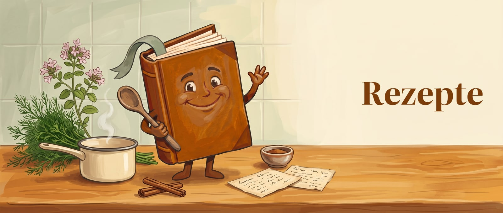
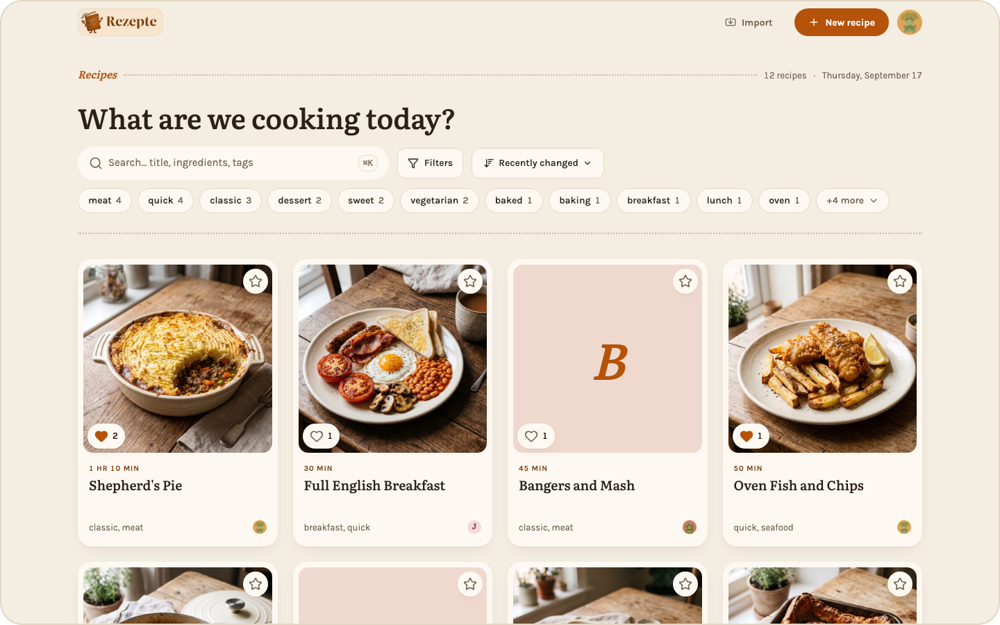
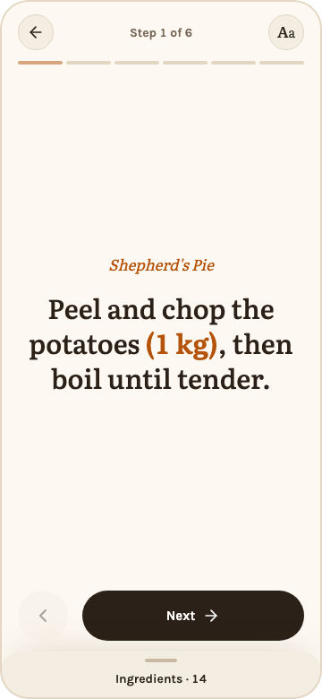

<div align="center">



# Rezepte

**A self-hosted recipe manager for the people you cook with.**<br>
Your family's and friends' recipes in one place, on your own server, without a cloud account.

[](https://github.com/s-frei/rezepte/actions/workflows/ci.yml)
[](https://github.com/s-frei/rezepte/releases/latest)
[](https://s-frei.github.io/rezepte/)
[](LICENSE)

[Documentation](https://s-frei.github.io/rezepte/) · [Getting started](https://s-frei.github.io/rezepte/getting-started/) · [Features](https://s-frei.github.io/rezepte/guide/) · [Changelog](https://s-frei.github.io/rezepte/changelog/) · [API](https://s-frei.github.io/rezepte/api/) · [Roadmap](https://s-frei.github.io/rezepte/roadmap/)

<picture>
  <source media="(prefers-color-scheme: dark)" srcset="assets/readme/overview-desktop-dark.png">
  
</picture>
<picture>
  <source media="(prefers-color-scheme: dark)" srcset="assets/readme/cook-mode-mobile-dark.png">
  
</picture>

</div>

*Rezepte* is German for "recipes". You run it once, invite your household and your friends with a link, and everyone writes down what they cook: ingredient groups, steps, photos, where the recipe comes from. Then you find it again by title, ingredient or tag, and cook from your phone at the stove. The interface is modern and made for the phone first: light and dark, a bottom bar under your thumb, <kbd>⌘</kbd><kbd>K</kbd> to jump anywhere.

It runs as **one binary** with the web app built in, an SQLite database and your photos in a single data directory: no Node runtime, no database server, no external services.

## Try it

Demo mode fills an empty instance with twelve sample recipes, most of them with AI-generated photos, so you can click through the real app without setting anything up:

```bash
docker run --rm -p 8060:8060 ghcr.io/s-frei/rezepte:latest --demo
```

Open <http://localhost:8060> and log in as **`demo`** / **`demo1234`**.

> [!NOTE]
> Nothing is kept: there is no volume, and `--rm` removes the container when it stops. To keep what you write, [run your own instance](#run-your-own-instance).

## Features

- 🍳 **Cooking:** a full-screen [cook mode](https://s-frei.github.io/rezepte/guide/cook-mode/) for the phone at the stove, steps that show the amounts they use, quantities [scaled to your servings](https://s-frei.github.io/rezepte/guide/servings/), and [a shopping list to copy](https://s-frei.github.io/rezepte/guide/servings/#copy-a-shopping-list) with everything you have not ticked off.
- 📖 **Collection:** [recipes](https://s-frei.github.io/rezepte/guide/recipes/) with ingredient groups, notes, times and their source (a book, a website or a person), [several photos each](https://s-frei.github.io/rezepte/guide/images/), [tags and search](https://s-frei.github.io/rezepte/guide/tags-and-search/) by ingredient, time or author, private favorites, and [tasty marks](https://s-frei.github.io/rezepte/guide/recipes/#tasty) that show who liked what.
- 👥 **People:** [accounts and roles](https://s-frei.github.io/rezepte/guide/users/) with a one-time setup link instead of a handed-over password, [profile photos](https://s-frei.github.io/rezepte/guide/settings/#profile), [sign-in with Google or your own OIDC provider](https://s-frei.github.io/rezepte/operations/single-sign-on/), and [sharing](https://s-frei.github.io/rezepte/guide/sharing/) as a household link, a public link that expires, or [an image for any messenger](https://s-frei.github.io/rezepte/guide/sharing/#pass-on-as-an-image).
- 🔌 **Your data:** [zip export and import](https://s-frei.github.io/rezepte/guide/import-export/) between instances, an [HTTP API](https://s-frei.github.io/rezepte/api/) with scoped [tokens](https://s-frei.github.io/rezepte/api/tokens/) and an OpenAPI reference, and an [MCP server](https://s-frei.github.io/rezepte/api/mcp/) for AI assistants.

English and German are built in, and every member picks their own. Missing your language? [Adding one](https://s-frei.github.io/rezepte/contributing/add-a-language/) takes two files and no programming.

<details>
<summary><b>What an AI assistant can do through MCP</b></summary>

<br>

Connect Claude Code, Cursor, VS Code or any MCP client that sends a token header. The assistant gets ten tools, each limited by what the token allows:

| Token level | Tools |
| --- | --- |
| **Read** | search recipes, read a recipe, list the tags in use |
| **Write** | create a recipe, edit a recipe, star or unstar it, mark it tasty or take the mark back |
| **Delete** | delete a recipe with its photos |

Photos are not part of MCP, and nothing touches accounts or passwords. Clients that only connect through OAuth, such as claude.ai's custom connectors, are not supported yet. → [Connect an AI assistant](https://s-frei.github.io/rezepte/api/mcp/)

</details>

## Coming from Mealie, Tandoor or Paprika?

They are mature apps, and Rezepte is younger and smaller. Here is what it does well:

- **A modern interface made for the phone.** Cook mode, a bottom bar and the command palette are part of the design from the start, not added later.
- **AI assistants built in.** A first-party MCP server, and API tokens with their own level per area, from read-only up to delete, instead of a token that can do everything its owner can.
- **Sharing you stay in control of.** Public links expire and can be revoked one by one or all at once, link previews start switched off, and a recipe can travel as a plain image.
- **Invitation only.** Nobody can register on their own, and nobody gets an account just by having one at your sign-in provider.
- **Little to run.** No database server or runtime to look after, and an Apache 2.0 license.

What it does not do yet: import from a URL or from other apps, plan meals, add up a shopping list across recipes, convert units, show nutrition, or send email. If you need those today, Mealie and Tandoor do them well.

> [!TIP]
> None of these are ruled out. The [roadmap](https://s-frei.github.io/rezepte/roadmap/) lists what is being considered, and I am open to anything that helps people cook. If you are missing something, [open an issue](https://github.com/s-frei/rezepte/issues) and tell me what you need.

## What to expect

- **Stable since 1.0.** Rezepte follows [semantic versioning](https://semver.org): only a new major version can ask something of you, and such a release says so at the top of its [changelog](https://s-frei.github.io/rezepte/changelog/) page.
- **Your data stays yours.** Everything lives in one directory: an SQLite database and plain JPEG files. [Back up the whole directory](https://s-frei.github.io/rezepte/operations/data-and-backup/) before every update, and use [zip export](https://s-frei.github.io/rezepte/guide/import-export/) to move recipes to another instance.
- **One maintainer.** I built Rezepte because I needed it myself. Issues get read, but there is no support guarantee.
- **Developed AI-driven.** Most of the code and all of the documentation is written by AI coding agents, working against the guidelines and the agent memory in this repository, and reviewed and steered by me. It is an experiment as much as a workflow, and a good part of why I enjoy building this.

## Run your own instance

Compose is the setup Rezepte is meant to be run with. Save this as `docker-compose.yaml`, choose your own owner password, and start it with `docker compose up -d`:

```yaml
services:
  rezepte:
    image: ghcr.io/s-frei/rezepte:latest
    restart: unless-stopped
    volumes:
      - rezepte-data:/data
    environment:
      REZEPTE_ADMIN_PASSWORD: change-me-now
    ports:
      - "8060:8060"

volumes:
  rezepte-data:
```

Open <http://localhost:8060> and log in as **`admin`** with the password you set. That account owns the instance. There is no self-registration, so invite everyone else from the settings once you are in.

> [!IMPORTANT]
> `REZEPTE_ADMIN_PASSWORD` is read only on the very first start, to create the owner. Afterwards, change the password inside the app; editing the variable does nothing.

`latest` is the newest stable release. Every version is on the [releases page](https://github.com/s-frei/rezepte/releases), and every image tag on the [package page](https://github.com/s-frei/rezepte/pkgs/container/rezepte). [Getting started](https://s-frei.github.io/rezepte/getting-started/) covers plain `docker run`, the binary with systemd, and every setting.

## Documentation

Everything lives at **[s-frei.github.io/rezepte](https://s-frei.github.io/rezepte/)**:

| Page | What you find there |
| --- | --- |
| [Getting started](https://s-frei.github.io/rezepte/getting-started/) | Run Rezepte with Docker or as a binary, and log in for the first time. |
| [Tour of the app](https://s-frei.github.io/rezepte/guide/) | Every feature, with screenshots. |
| [Operations](https://s-frei.github.io/rezepte/operations/data-and-backup/) | Where the data lives, backups, updates, reverse proxies and [single sign-on](https://s-frei.github.io/rezepte/operations/single-sign-on/). |
| [API](https://s-frei.github.io/rezepte/api/) | The HTTP API behind the app, with a generated reference, and the MCP server for AI assistants. |
| [Changelog](https://s-frei.github.io/rezepte/changelog/) | What changed in each release, and what to do before you update. |
| [Roadmap](https://s-frei.github.io/rezepte/roadmap/) | Where Rezepte could go next. |
| [Contributing](https://s-frei.github.io/rezepte/contributing/add-a-language/) | Translate the interface into another language. |

AI assistants can read the whole manual too: [`/llms.txt`](https://s-frei.github.io/rezepte/llms.txt) indexes it and [`/llms-full.txt`](https://s-frei.github.io/rezepte/llms-full.txt) is all of it in one file.

## Development

The stack is a Go service serving a bundled SvelteKit SPA, with SQLite for storage. Every tool is pinned, and every task runs through [mise](https://mise.jdx.dev):

```bash
mise trust && mise install && mise run setup   # tools and dependencies
mise run dev                                   # app on :9060, API on :8060
mise run check                                 # every lint, format and test gate
```

`mise run dev` creates a local `admin` / `admin1234` login on first start and prints it.

The long-form developer documentation (architecture, conventions and how-tos) lives in the repository under [`docs/memory/content/`](docs/memory/content/) and is not published.

## Contributing

Contributions are welcome. Open an issue for anything you hit or miss. For a pull request, branch off `develop`, keep `mise run check` green, and write everything in English except the UI copy in `frontend/messages/`, which has one catalog per language.

A translation is the easiest way in: [Add a language](https://s-frei.github.io/rezepte/contributing/add-a-language/) walks through it, and it needs no code.

## License

[Apache License 2.0](LICENSE)
