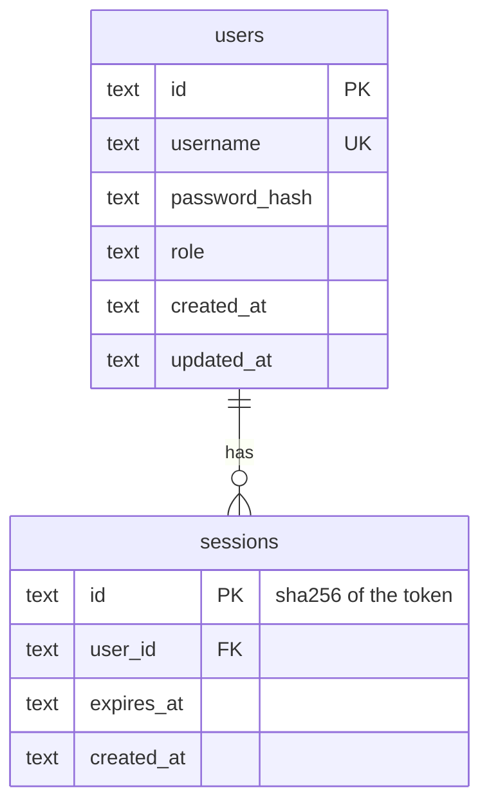

## Conventions

- IDs: UUIDv7 strings (`uuid.Must(uuid.NewV7()).String()`), sortable by creation time.
- Timestamps: RFC 3339 UTC strings via `db.FormatTime` / `db.ParseTime`.
- Foreign keys are enforced (`PRAGMA foreign_keys=ON`); deletes cascade.
- Usernames are unique case-insensitively (`COLLATE NOCASE`).
- Session ids are SHA-256 digests of the bearer token; the raw token exists only in the cookie.

Recipe tables arrive in Phase 3 and will be added here.
