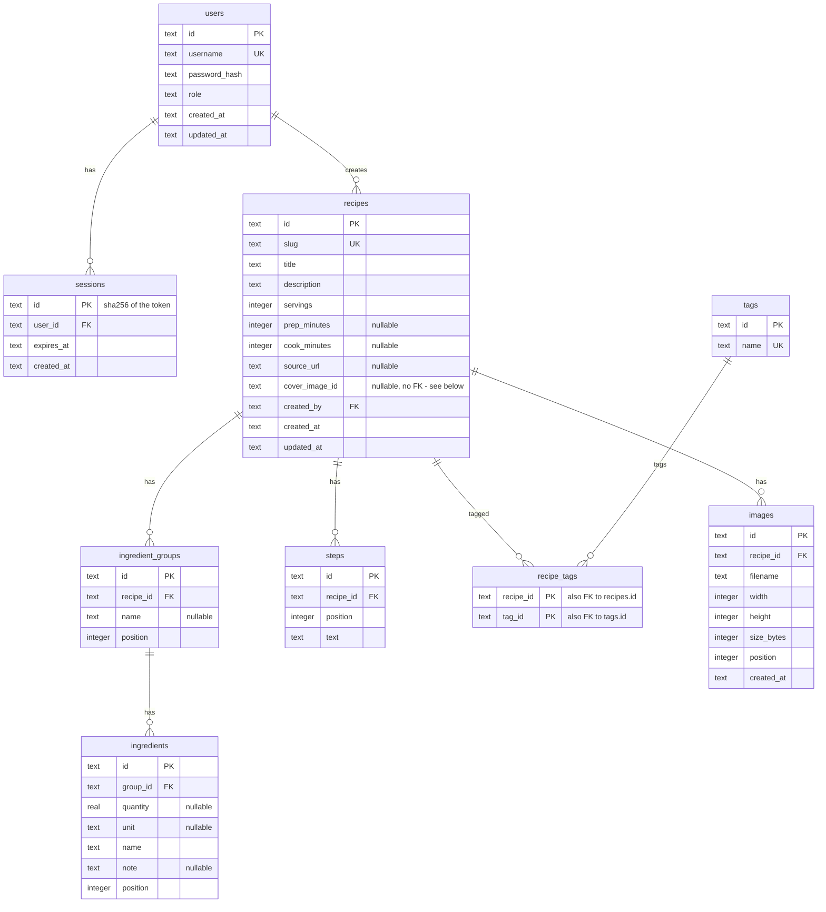

## Conventions

- IDs: UUIDv7 strings (`uuid.Must(uuid.NewV7()).String()`), sortable by creation time.
- Timestamps: RFC 3339 UTC strings via `db.FormatTime` / `db.ParseTime`.
- Foreign keys are enforced (`PRAGMA foreign_keys=ON`); deletes cascade. The one exception is `recipes.cover_image_id`, a plain nullable `TEXT` with no `REFERENCES` constraint - it points at `images`, a table Phase 4 (uploads) starts writing to, and a hard FK would force upload/recipe write ordering the schema doesn't need yet.
- Usernames are unique case-insensitively (`COLLATE NOCASE`).
- Session ids are SHA-256 digests of the bearer token; the raw token exists only in the cookie.
- `ingredient_groups.position`, `ingredients.position` and `steps.position` are 0-based integers, rewritten sequentially in full on every recipe save (see [ADR 0009](/memory/decisions/0009-recipes-as-documents-with-fts5)) - never edited in place, so there are no gaps or renumbering to reason about between saves.
- NULL means "absent," not "empty": `prep_minutes`, `cook_minutes`, `source_url`, `cover_image_id`, `ingredient_groups.name`, `ingredients.unit` and `ingredients.note` are stored as `NULL`, never `''`, when unset (the service converts an empty string to `nil` on write). `recipes.description` is the exception - it defaults to `''`, not `NULL`, when omitted.
- Tags are implicit: `tags` only ever holds names currently used by at least one recipe (see ADR 0009); there is no separate tag-management table or endpoint.
- `images` exists as of the Phase 3 migration but stays empty until Phase 4 (uploads) starts writing to it; `recipes.cover_image_id` has a target column to point at once that ships.
- `recipes_fts` (contentless FTS5, `content=''`) is not shown above - it duplicates no data and has no foreign keys; it's a search index keyed by `recipes.rowid`, maintained by the recipe service rather than the schema. See [ADR 0009](/memory/decisions/0009-recipes-as-documents-with-fts5).
