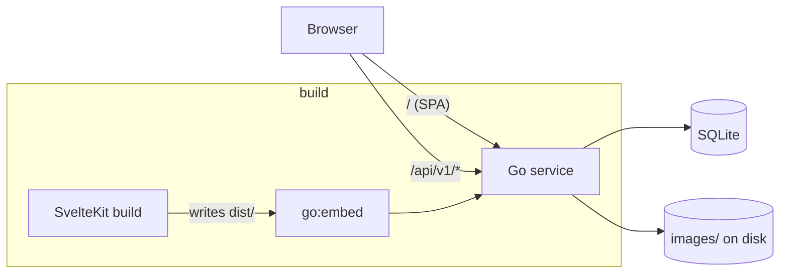

## Runtime

One process. `cmd/rezepte/main.go` loads config from `REZEPTE_*` variables, opens SQLite (Phase 2), runs migrations (Phase 2), seeds the initial admin (Phase 2), and starts `httpserver`. The mux serves `/healthz`, the huma API under `/api/v1`, and the embedded SPA for everything else with an `index.html` fallback.

## Packages

<Tabs items={['service', 'frontend', 'docs']}>
  <Tab value="service">

    - `internal/config` – env to struct
    - `internal/httpserver` – mux, huma, middleware, SPA handler, lifecycle
    - `internal/web` – embedded `dist/`
    - one package per domain (`auth`, `user`, `recipe`, `image`, `importer`) with `handler → service → sqlc` layering

  </Tab>
  <Tab value="frontend">

    - `src/lib/api` – fetch wrapper and per-resource functions
    - `src/lib/components/ui` – styled wrappers around Bits UI
    - `src/lib/components/recipe`, `editor` – feature components
    - `src/routes` – file-based routes, `+layout.ts` sets `ssr = false`
    - `messages/de.json` – UI copy

  </Tab>
  <Tab value="docs">

    - `memory/` – this section
    - `user/` – end-user docs
    - `app/` – Fumadocs/Next.js glue, do not put content here

  </Tab>
</Tabs>

## Configuration

<TypeTable
  type={{
    REZEPTE_ADDR: { description: 'Listen address', type: 'string', default: ':8080' },
    REZEPTE_DATA_DIR: { description: 'Directory with rezepte.db and images/', type: 'string', default: './data' },
    REZEPTE_ADMIN_USER: { description: 'Initial admin username (first start only)', type: 'string', default: 'admin' },
    REZEPTE_ADMIN_PASSWORD: { description: 'Initial admin password (first start only)', type: 'string' },
    REZEPTE_LOG_LEVEL: { description: 'debug, info, warn, error', type: 'string', default: 'info' },
    REZEPTE_LOG_FORMAT: { description: 'text or json', type: 'string', default: 'text' },
    REZEPTE_SECURE_COOKIES: { description: 'Set Secure on the session cookie', type: 'boolean', default: 'false' },
  }}
/>
