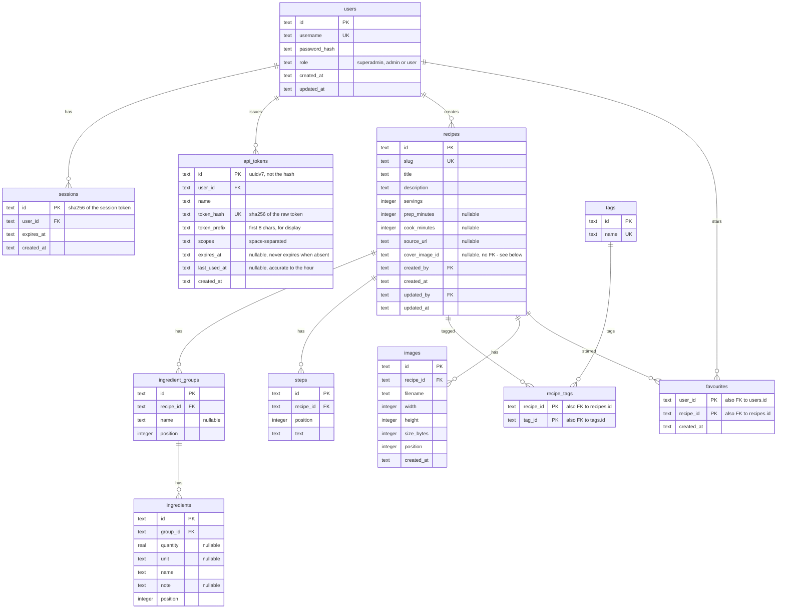

## Conventions

- IDs: UUIDv7 strings (`uuid.Must(uuid.NewV7()).String()`), sortable by creation time.
- Timestamps: RFC 3339 UTC strings via `db.FormatTime` / `db.ParseTime`, with **second** resolution (`time.RFC3339`, no fractional part). Because two writes in the same second get the same `updated_at`, the recipe list and search queries (`queries/recipes.sql`) break ties with `id DESC`: UUIDv7 ids sort lexicographically by creation time, so the newest row still sorts first. Without that tiebreaker, two recipes saved in the same second come back oldest first. If a fractional part is ever added to `FormatTime`, it must be fixed-width - `time.RFC3339Nano` trims trailing zeros, and a shortened fraction no longer sorts lexicographically the same as the full value.
- The connection DSN in `service/internal/db/db.go` sets the pragmas: `journal_mode(WAL)`, `busy_timeout(5000)`, `synchronous(NORMAL)`, `foreign_keys(ON)`, `recursive_triggers(ON)` and `_txlock=immediate`. The recursive triggers are not for a trigger that writes - there is none - but because SQLite fires a `BEFORE DELETE` trigger for the delete half of a `REPLACE` only when that pragma is on.
- Foreign keys are enforced; deletes cascade. The one exception is `recipes.cover_image_id`, a plain nullable `TEXT` with no `REFERENCES` constraint: it points at `images.id` but carries no FK because the image service keeps it consistent itself (set on first upload, moved on delete of the cover) - a FK with `ON DELETE SET NULL` would silently clear it instead of promoting the next image (see [Images](/features/images)).
- `favourites` is keyed by `(user_id, recipe_id)` and both foreign keys cascade, so a star never outlives the user or the recipe it belongs to. The primary key already serves lookups by user; `favourites_recipe_idx` on `recipe_id` serves the reverse direction, which the per-page card lookup uses. See [Favourites](/features/favourites).
- Usernames are unique case-insensitively (`COLLATE NOCASE`).
- `users.role` holds `superadmin`, `admin` or `user`, and a `CHECK` admits nothing else. `users_superadmin_idx` is unique and partial on `role = 'superadmin'`, so "at most one instance owner" is a property of the database rather than of the code writing to it. Two triggers carry the other half of that guarantee: `users_superadmin_undeletable` aborts a `DELETE` of the owner's row, `users_superadmin_role_locked` aborts an `UPDATE OF role` on it. They are the net underneath [Users and authentication](/features/users-and-auth), which owns the refusals a person sees, with their errors and status codes; on every connection the service opens they hold as well for a raw query and for a code path that forgets to ask. They catch an `INSERT OR REPLACE` over the owner's row only because that DSN sets `recursive_triggers(ON)` - the pragma is per connection, so a `sqlite3` CLI session against the file, which defaults to off, can still `REPLACE` past a `BEFORE DELETE` trigger.
- The triggers and `users_superadmin_idx` exist only in a database created from the current `0001_users_and_sessions.sql`; one created before that edit has neither. Editing `0001` in place rather than adding a migration is only safe because `user.ErrNoSuperadmin` refuses to start against a non-empty `users` table without an owner, which is exactly the shape every one of those databases has. Anything that relaxes that refusal - promoting the first admin to owner on start, say - lets them run with no storage backstop at all, in the one case where the Go guards would be the only thing holding the invariant.
- A session id is the SHA-256 digest of the session's own random token; the raw value exists only in the cookie and is never stored. An API token is a distinct credential (see [API tokens](/features/api-tokens)): its row keeps a UUIDv7 `id` and stores the raw value's digest separately, in `token_hash`.
- `ingredient_groups.position`, `ingredients.position` and `steps.position` are 0-based integers, rewritten sequentially in full on every recipe save (see [Recipes and search](/features/recipes)) - never edited in place, so there are no gaps or renumbering to reason about between saves.
- NULL means "absent," not "empty": `prep_minutes`, `cook_minutes`, `source_url`, `cover_image_id`, `ingredient_groups.name`, `ingredients.unit` and `ingredients.note` are stored as `NULL`, never `''`, when unset (the service converts an empty string to `nil` on write). `recipes.description` is the exception - it defaults to `''`, not `NULL`, when omitted.
- Tags are implicit: `tags` only ever holds names currently used by at least one recipe (see [Recipes and search](/features/recipes)); there is no separate tag-management table or endpoint.
- `images.filename` is `<id>.jpg`; the three variants (`<id>.jpg`, `<id>_detail.jpg`, `<id>_thumb.jpg`) live in `<REZEPTE_DATA_DIR>/images/<recipe_id>/`, outside the database; `width`/`height` are the largest variant's; `size_bytes` sums all three; `position` is compact `0..n-1` like the other position columns, rewritten on delete and reorder. See [Images](/features/images).
- `recipes_fts` is not shown above: an FTS5 virtual table is a search index rather than a relation - it holds no copy of the text and no foreign keys, so there is nothing for the diagram to connect it to. [Recipes](/features/recipes) owns how it is declared, keyed and kept in step.
- `recipes.created_by` and `recipes.updated_by` are both `NOT NULL` without `ON DELETE`; deleting a user moves every recipe they wrote **or last edited** to the acting admin (see [Users and authentication](/features/users-and-auth)). Sessions and API tokens both cascade: deleting a user removes both.
- `updated_by` always names somebody: a new recipe seeds it from `created_by`, so "never edited" is "both columns still match their `created_*` twin" rather than a NULL. Reading it needs both — with second resolution, an edit in the same second as the create moves only `updated_by`. Every write that moves `updated_at` moves `updated_by` with it - image uploads and cover changes included (see [Recipes and search](/features/recipes)).
- `api_tokens.token_hash` is `UNIQUE`, which doubles as the lookup index for authentication; `id` is a separate UUIDv7 rather than the hash, because a token is deleted from a list at a moment the raw value no longer exists to hash again. `token_prefix` keeps the first 8 characters of the raw value in clear, for matching a row in the list against an entry in a client configuration. See [API tokens](/features/api-tokens).

## Why it is this way

A recipe collection for one household has no use for a database server. SQLite is a file beside the images directory, and `modernc.org/sqlite` is a pure-Go driver, so `CGO_ENABLED=0` holds: the binary is static and the runtime image is `distroless/static`, with no C toolchain anywhere in the build and no libraries to match at runtime.

Queries are hand-written SQL under `service/internal/db/queries/`, compiled by sqlc into typed Go under `service/internal/db/sqlc/`, and the generated code is committed. Writing the SQL by hand is what keeps FTS5 and the recipe aggregate's whole-document write expressible at all; generating the scanning is what makes the compiler check that a query's columns and the struct receiving them still agree after an edit. Committing the output means a checkout builds without sqlc installed, and a query changed without regenerating shows up as a diff the gate fails on rather than as a surprise at runtime.

sqlc reads the goose migration files themselves as its schema - `service/sqlc.yaml` points `schema` at `internal/db/migrations` - so the schema has exactly one source of truth and there is no second declaration to drift from the one that actually runs.

Migrations are embedded with `go:embed` and applied by `db.Migrate` as the process starts, so deploying is one binary and no separate migration step for an operator who runs this at home. They are numbered sequentially rather than by timestamp: timestamps exist to stop migrations authored on parallel branches from colliding, and a single migration stream gains nothing from them but an unreadable filename.

Tests run against a real migrated database rather than mocks. `dbtest.Open` opens a throwaway file in the test's own temp directory and applies every migration to it, so a query test meets the same SQLite, the same pragmas and the same schema as production - including the FTS5 table and the `_txlock=immediate` transaction behaviour that the rank guards on the `users` table lean on.

[Add a database migration](/howtos/add-migration) owns the procedure, and the rule about editing an existing migration rather than adding one that holds until the first release ships.

## Rejected

- **A CGO SQLite driver (`mattn/go-sqlite3`).** It needs a C toolchain in the build image and gives up the static binary, in exchange for performance nothing here is waiting on.
- **Hand-written scanning.** Boilerplate for every query and no compile-time check that a query and its destination still match.
- **An ORM (GORM, ent).** It hides the SQL and fights the two things this schema leans on hardest: an FTS5 virtual table maintained by hand, and a save that rewrites the recipe row, every child table and the search index in one transaction.
