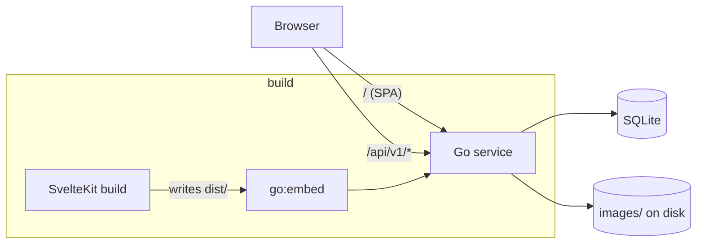

## Runtime

One process. `cmd/rezepte/main.go` loads config from `REZEPTE_*` variables, opens SQLite, runs migrations, ensures the instance owner, and starts `httpserver`. `--reset-superadmin-password` cuts that short: it sets the owner's password from `REZEPTE_ADMIN_PASSWORD`, drops every session of that account and returns without serving. The mux serves `/healthz`, the huma API under `/api/v1`, and the embedded SPA for everything else with an `index.html` fallback.

## Packages

<Tabs items={['service', 'frontend', 'docs']}>
  <Tab value="service">

    - `internal/config` – env to struct
    - `internal/httpserver` – mux, huma, middleware, SPA handler, lifecycle
    - `internal/web` – embedded `dist/`
    - one package per domain (`auth`, `user`, `recipe`, `image`, `settings`) with `handler → service → sqlc` layering
    - `internal/userapi`, `internal/tokenapi` – the admin-only user and token operations; handlers only, in packages of their own because they need `auth` and `auth` already imports `user`
    - `internal/i18n` – the set of interface languages, read from `locales.json` (see [Languages](/features/languages))
    - `internal/demo` – seeds the sample recipes with their embedded photos through those services for `--demo`, with generated placeholders only for a sample set that has no photos (see [Demo mode](/features/demo-mode))
    - `cmd/demo-photos` – derives the embedded demo photos from the originals in `assets/demo-photos`

  </Tab>
  <Tab value="frontend">

    - `src/lib/api` – fetch wrapper and per-resource functions
    - `src/lib/components/ui` – styled wrappers around Bits UI
    - `src/lib/components/recipe`, `editor`, `cook`, `nav`, `settings`, `shell` – feature components
    - `src/lib/recipe` – pure recipe logic (query state, form mapping, quantity formatting, servings scaling) and its rune stores
    - `src/routes` – file-based routes, `+layout.ts` sets `ssr = false`
    - `messages/en.json`, `de.json` – UI copy, one catalog per language

  </Tab>
  <Tab value="docs">

    Two independent Fumadocs apps, each with its own `package.json` and `app/` (Fumadocs/Next.js glue, no content):

    - `memory/` – this section, in `content/`, rendered by the app in `docs/memory/` on port 4000 by default (`mise run ports` for this worktree's number)
    - `user/` – a separate Fumadocs app on port 4001 by default (`mise run ports` for this worktree's number): `content/` (end-user pages; `api/reference/` is generated, never hand-edited), `components/screenshot.tsx` (the `<Screenshot>` placeholder-fallback component), `screenshots/` (Playwright specs), `scripts/` (the OpenAPI fetch/generate, screenshot-audit and base-path-audit scripts; the demo instance they run against comes from the root `//:demo` task), `public/screenshots/` (committed PNGs)

  </Tab>
</Tabs>

## Configuration

<TypeTable
  type={{
    REZEPTE_ADDR: { description: 'Listen address', type: 'string', default: ':8060' },
    REZEPTE_DATA_DIR: { description: 'Directory with rezepte.db and images/', type: 'string', default: './data' },
    REZEPTE_ADMIN_USER: { description: 'Instance owner username (first start only)', type: 'string', default: 'admin' },
    REZEPTE_ADMIN_PASSWORD: { description: 'Instance owner password (first start, and --reset-superadmin-password)', type: 'string' },
    REZEPTE_LOG_LEVEL: { description: 'debug, info, warn, error', type: 'string', default: 'info' },
    REZEPTE_LOG_FORMAT: { description: 'text or json', type: 'string', default: 'text' },
    REZEPTE_LOCALE: { description: 'Interface language of a new account, and the demo sample set', type: 'string', default: 'en' },
    REZEPTE_SECURE_COOKIES: { description: 'Set Secure on the session cookie', type: 'boolean', default: 'false' },
  }}
/>

## Why it is this way

One process is the whole point. A household installs a binary and a volume, so anything that would make the deployment two things - a Node server, a database server, a reverse proxy tying them together - has to earn that cost, and none of it does at this size.

That is why the frontend is files rather than a server. `@sveltejs/adapter-static` with `ssr = false` and `fallback: 'index.html'` writes the build into `service/internal/web/dist`, which `internal/web` embeds, so the SPA ships inside the binary and there is no Node runtime in production. There is no `svelte.config.js`: the kit configuration, adapter options included, lives inline in `frontend/vite.config.ts`. The price is paid in the open: there are no server load functions, every page fetches through `$lib/api` in the browser, and the root `+layout.ts` has to resolve the session before any page renders. Every page sits behind a login and none of it is indexed, so what server rendering would buy is worth nothing here.

The SPA is Svelte 5 with runes and TypeScript throughout. Bits UI is used headless and styled by hand, so the visual direction stays a decision made in this repository rather than one inherited from a component library's own style system ([Design system](/architecture/design-system)). UI copy lives in Paraglide message files rather than in components, one catalog per language (see [Languages](/features/languages)), which is what keeps the UI's two languages out of the code and the code itself English. [Svelte conventions](/conventions/svelte) owns the rules that follow from all three.

[Toolchain](/architecture/toolchain) owns the build and the task surface that produce all of this.

## Rejected

- **SvelteKit on `adapter-node` behind the Go service.** Two processes and a second runtime to keep patched, for server rendering of pages that all sit behind a login.
- **shadcn-svelte.** A faster start, but it arrives with its own tokens and `cn()` conventions, and the look of this app is not a thing to inherit.
