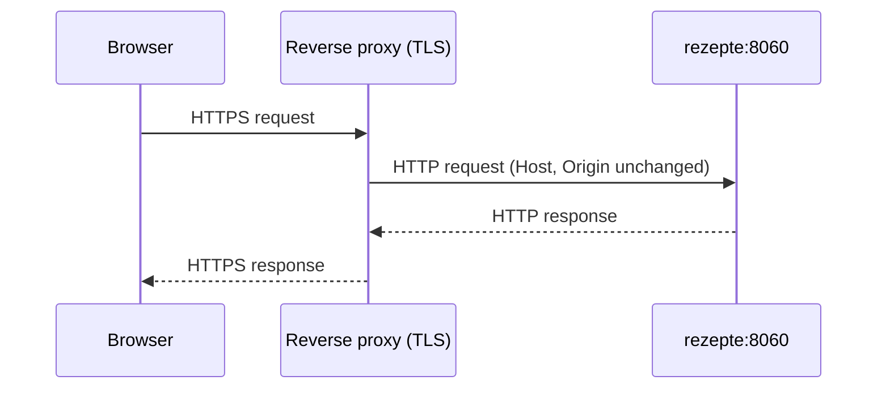

Rezepte itself only speaks plain HTTP. Terminate TLS at a reverse proxy in front of it and forward everything to its port (8060 by default).



<Tabs items={['Caddy', 'nginx']}>
  <Tab value="Caddy">

    ```text title="Caddyfile"
    rezepte.example.com {
      reverse_proxy localhost:8060
    }
    ```

    Caddy forwards `Host` and `Origin` unchanged and provisions TLS automatically.

  </Tab>
  <Tab value="nginx">

    ```nginx
    location / {
      proxy_pass http://127.0.0.1:8060;
      proxy_set_header Host $host;
      proxy_set_header Origin $http_origin;
    }
    ```

  </Tab>
</Tabs>

<Callout type="warn">
  The proxy must forward the `Host` and `Origin` headers unchanged. The API rejects a mutating request (`POST`/`PUT`/`PATCH`/`DELETE`) whose `Origin` header names a different host than the request's `Host` — this is what stops cross-site requests from acting on a logged-in session. A proxy that rewrites either header, or that terminates TLS without passing the original `Host` through, will lock the app's own login and editing out.
</Callout>

Once the app is reachable over HTTPS, set `REZEPTE_SECURE_COOKIES=true` so the session cookie gets the `Secure` attribute (see [Configuration](/getting-started/configuration)).
